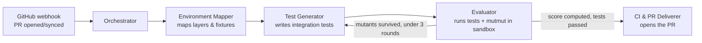

# Killjoy

**Kills your fake tests before your mutants do.**

[](LICENSE)


Your test suite says it's covered. Killjoy doesn't take its word for it.

Code coverage tells you a line of code ran during a test. It says nothing about whether the test would actually notice if that line were wrong. You can hit 100% coverage with tests that assert almost nothing and would never catch a real bug. Killjoy generates real pytest integration tests for a pull request, then tries to kill its own tests by planting small bugs in the code and checking whether anything notices. If a bug survives, Killjoy goes back and writes a better test aimed at exactly that gap, up to three rounds, and only opens a PR once it has something it can actually prove.

## What it looks like

Killjoy doesn't just say "added some tests." It opens a PR that reads like this:

```markdown
## Killjoy Integration Tests

**Sandbox run:** ✅ passed against real code.
**Mutation score:** 91.0% (10 killed / 11 total mutants)

### Surviving mutants (not caught by these tests)

- `app/service.py:12` — changed `>=` to `>`, bulk discount boundary at
  exactly 5 items is no longer caught by any generated test.

_This PR was generated automatically by Killjoy and has not been
auto-merged. Review before merging._
```

That surviving mutant isn't hypothetical, it's one of the planted bugs in this repo's own demo scenarios (`eval/known_bugs.json`). A real off-by-one that a normal test suite would happily ship, stated in the PR instead of hidden in a coverage report nobody reads closely.

**See it running for real:** [demo-repo-killjoy#9](https://github.com/IlaakshMishra/demo-repo-killjoy/pull/9) is an actual Killjoy-opened PR from a live deployment — triggered by a real GitHub webhook, generated tests, mutation-tested in a real sandbox, opened with no human in the loop.

## Why not just ask an LLM to write some tests

Because that part is already commoditized. Copilot, Qodo, and Claude Code itself are all reasonably good at generating a unit test for a function you point them at. What none of them prove is whether the test they wrote is actually worth anything, or whether it's the kind of vacuous assertion that passes today and would still pass if you deleted half the logic. Killjoy's entire reason to exist is that proof. It doesn't grade its own homework, it runs mutation testing against the code it just wrote tests for and reports the number, surviving mutants and all, in the open.

It also generates *integration* tests specifically, not unit tests. Unit tests only need to understand one function. Integration tests need to understand how a service layer, a repository, and an API handler actually behave together, which is a meaningfully harder problem and the one most neglected by teams and tools alike.

## How it works



Four specialist agents behind an orchestrator, running on AWS Bedrock AgentCore. Not a parallel fan-out, a pipeline with a bounded feedback loop, since each stage genuinely needs the last one's output.

- **Environment Mapper** reads the repo's call graph, its existing `conftest.py` fixtures, and its layer boundaries, then classifies which layers are safe to exercise for real and which are outer edges that need a substitute.
- **Test Generator** writes the actual pytest integration tests, using only real internal code plus whatever substitutes the mapper flagged.
- **Evaluator** runs those tests for real in a sandbox, then runs `mutmut` scoped to just the lines the PR touched. Anything that survives goes back to the Test Generator with the specific gap, not a vague "try again."
- **CI & PR Deliverer** only acts once the sandbox has proven the tests pass and a mutation score exists. Commits to a dedicated branch, adds a GitHub Actions stage to run the tests going forward, opens the PR.

Full task-by-task build plan is in `docs/superpowers/plans/2026-08-08-killjoy-integration-test-mutation.md`.

## The code, agent by agent

Each agent is a small [Bedrock AgentCore](https://aws.amazon.com/bedrock/agentcore/) runtime — a container with a single `@app.entrypoint` handler in `main.py` — with its actual logic split into plain, dependency-injected, unit-testable modules that never touch AWS directly. `main.py` is just wiring: it builds the real AWS clients/LLM and hands them to the logic module as injected callables, so the logic can be tested with fakes and no network calls.

### `lambda/webhook_handler/` — the front door

A single Lambda (`handler.py`) sits behind API Gateway and receives GitHub's webhook. It's split into two entrypoints because of one hard constraint: **API Gateway HTTP APIs cap the Lambda proxy integration at ~29 seconds, but the full Killjoy pipeline routinely runs for minutes.**

- `dispatch_handler` — what API Gateway actually calls. Verifies the `X-Hub-Signature-256` HMAC against the webhook secret (pulled from Secrets Manager), checks the event is `pull_request` with `action` in `opened`/`synchronize`, then **asynchronously re-invokes the same Lambda function** (`InvocationType="Event"`) with the raw event and returns `202` immediately — all in well under a second.
- `lambda_handler` — runs inside that async re-invocation, outside API Gateway's timeout entirely. This is the one that actually calls `invoke_agent_runtime` on the Orchestrator and blocks until it returns, bounded only by the Lambda's own 900s timeout.

### `app/OrchestratorAgent/` — the conductor

This is the only agent that talks to all the others — everything else is a one-shot function that takes structured input and returns structured output, with no idea the rest of the pipeline exists. The Orchestrator is the state machine: it decides *whether* a run happens at all (the dedup/rate-limit check), gathers the raw materials every other agent needs (the diff, the touched files, the whole repo), and then walks the four stages in a fixed order, feeding each one's output into the next. The one loop in the whole system lives here too — Test Generator and Evaluator alternate up to 3 times, because a first-draft test commonly misses a mutant, and the fix for that is "tell the generator exactly which mutant survived and let it try again," not "give up." Any stage failing anywhere aborts the whole thing immediately — there's no partial-credit path, no half-written PR.

- `main.py` — receives the webhook payload, calls `reserve_run` (the dedup/rate-limit guardrail) *before* doing anything expensive, clones the target repo with a short-lived GitHub token, builds the PR's diff (`git diff base...head`), and reads two views of the repo: `repo_files` (just the touched paths) and `whole_repo_files` (every `.py` file, used so downstream agents can see real dependency code they didn't touch but still need to import).
- `pipeline.py` — pure function, no AWS: `run_pipeline(request, invoke_env_mapper, invoke_test_generator, invoke_evaluator, invoke_ci_deliverer)`. Calls the Environment Mapper once, then loops Test Generator → Evaluator up to `max_mutation_rounds` (default 3), feeding any surviving mutants back into the next generation round. Any stage returning an `"error"` key or raising aborts the whole run immediately — no partial state carries forward.
- `guardrails.py` — `reserve_run` does one atomic DynamoDB `TransactWriteItems`: a conditional `Put` on `killjoy-pr-runs` (fails if that PR already has a run — dedup is permanent, not retried, even if the run later fails) and a conditional `Update` on `killjoy-daily-counter` (fails once `daily_pr_ceiling` runs have happened today). Either condition failing rolls back the whole transaction.

### `app/EnvironmentMapperAgent/` — no LLM in the first half

Before anyone writes a single test, something has to answer: "if a test calls into this module, is it safe to let that call actually happen, or will it try to hit a real database / make a real HTTP request / do something a test shouldn't do?" That's the whole job here, and it's deliberately split into a cheap deterministic half and an expensive judgment half. The AST scan is pure code — no model, no cost, no chance of hallucinating a function that doesn't exist — and it produces a flat, factual inventory (every function, every import, every pytest fixture). Only *then* does an LLM look at that inventory and make the actual judgment call: this module is internal application logic (run it for real), that one's a database driver (fake it). Handing the LLM structured facts instead of raw source keeps this step cheap and keeps the one genuinely subjective decision in the whole pipeline — real vs. fake — contained to a single, auditable place.

- `scanner.py` — pure AST walk, zero LLM calls. Extracts every function/method, import, and pytest fixture (`@pytest.fixture`-decorated function) name from the repo, cheaply and deterministically.
- `synthesizer.py` — takes the scanner's raw structural JSON and makes one LLM call to classify each module into a layer and decide `none_real_execution` (run the real code) vs `in_memory`/`mock` (genuine outer edge — a DB driver, HTTP client, etc). This is the only place in the whole system that decides what NOT to run for real.

### `app/TestGeneratorAgent/` — where most of this session's real bugs lived

This is the agent that actually writes the pytest file — one LLM call, given the PR's diff, the environment map from the previous stage, and (once a mutant survives a round) the specific mutations the last test failed to catch. The hard part isn't getting the model to write *a* test; it's getting the model to write a test that only calls methods that actually exist. Left alone, an LLM asked to write a test against a `repository` object will confidently invent a method like `add_order_item` because it *sounds* right, even when the real method is `add_order` and its actual source is sitting in the same prompt. So this agent doesn't just ask nicely — it hands the model an exhaustive, AST-extracted list of every real method signature in scope (not prose, not "here's the file, figure it out"), and after generation it re-parses the model's own output and checks every method call against that list. If the model still invented something, the agent doesn't ship it: it tells the model exactly which call was fake and asks again, up to a few times, before giving up and letting the sandbox be the final judge.

- `generator.py` — builds the prompt from the diff, the environment map, and (added this session) the **actual source** of every file the environment map references, plus an **AST-extracted, exhaustive list of every real method/function signature** in those files (`_extract_signatures` / `_bare_method_names`). Raw source alone wasn't a strong enough grounding signal — the LLM would still invent a plausible-sounding method (e.g. `add_order_item` instead of the real `add_order`) even with the real code sitting right there in the prompt. The explicit signature list is a harder constraint to ignore.
- After generation, `_find_unknown_fixture_calls` AST-walks the generated test and flags any `<fixture>.<method>(...)` call where `<fixture>` is a real pytest fixture parameter but `<method>` isn't in the known signature set — a cheap, targeted hallucination detector (no full type inference, just checks fixture-object calls specifically, since that's the actual failure mode observed). `generate_tests` retries up to `max_attempts` (default 3), naming the specific bad calls back to the model each time, before giving up and returning its best effort.

### `app/EvaluatorAgent/` — proves the tests actually work

This is the agent the whole project exists to justify — it's the one that stops Killjoy from just being "an LLM that writes tests and hopes." It does two things, in order, and neither is optional: first it proves the generated test actually passes against the *real*, unmodified code (not a syntax check — an actual `pytest` run, in an isolated sandbox, importing the real application). If that fails, the whole run stops right there; a test that doesn't even pass against correct code is worse than no test. Only once that's proven does it run mutation testing: `mutmut` mechanically rewrites the touched lines with small, deliberate bugs — a `>=` flipped to `>`, an `and` flipped to `or` — one mutant at a time, and reruns the generated test against each mutated version. If the test still passes, the mutant "survived," meaning the test wasn't actually checking the thing it looked like it was checking. The mutation score is just killed-mutants ÷ total-mutants — a number that measures whether the tests would notice if the logic broke, which is a fundamentally different (and much harder to fake) claim than "the tests are green." Getting an arbitrary AWS sandbox to actually run pytest and mutmut correctly turned out to be most of the real engineering here — see the three gotchas below.

- `sandbox.py` — drives an AWS Bedrock AgentCore **Code Interpreter** session via `writeFiles`/`executeCommand`. Three non-obvious things it has to get right, all discovered the hard way:
  1. **The sandbox's default network mode has no route to PyPI** (see `docs/spike-code-interpreter.md`) — `pip install pytest mutmut` just fails with a DNS error. So `pytest`/`mutmut` and their full dependency closure are pre-downloaded as `aarch64`/`cp312` wheels at repo-build time into `vendor_wheels/`, bundled into the Docker image, and uploaded into the sandbox as binary blobs (`{"path": ..., "blob": <bytes>}`), then installed offline with `pip install --no-index --find-links=vendor_wheels`.
  2. **The generated test must be written into the same directory as the repo's `conftest.py`** (`_find_test_directory`, picks the deepest one if several exist), not the sandbox root — pytest's fixture discovery only looks at a test file's own directory and its ancestors, not sibling directories, so a root-level test file can't see fixtures defined in `tests/conftest.py`.
  3. **mutmut copies only `source_paths` (the touched/mutated files) plus a fixed whitelist** (`tests/`, lockfiles, `setup.cfg`) into its own isolated `mutants/` staging directory for the clean test run — an untouched dependency module the touched file imports (e.g. `repository.py`, needed by `conftest.py`) never gets copied there, so the *copy* fails to import even though the real repo works fine. `also_copy=<every top-level source directory>` in the generated `setup.cfg` closes that gap.
- `runner.py` / `mutation.py` — the same pytest/mutmut logic via plain `subprocess.run` against a real local checkout, used by `scripts/evaluate_killjoy.py`'s offline self-eval (no sandbox needed there since the full repo already exists on disk).

### `app/CIPRDelivererAgent/` — only runs after the Evaluator has proof

This agent's entire reason for existing is that it's the *only* one allowed to touch the real repo, and it only ever gets invoked once every earlier stage has already succeeded — the Orchestrator won't call it on a failed or unproven run, so there's no code path here that has to defensively handle "what if the tests didn't actually pass." Given that green light, the job is mechanical: create a fresh branch (never commit to the repo's default branch), commit the generated test onto it, make sure a GitHub Actions workflow exists so those tests keep running on every future PR rather than just this once, push, and open the PR with the mutation score and any surviving mutants written directly into the description. Nothing here is a judgment call — the judgment already happened upstream.

- `git_ops.py` — clone/branch/commit/push helpers. Always passes `git -c user.name=... -c user.email=...` explicitly since a container has no resolvable hostname for git's identity auto-detection.
- `workflow_injector.py` — writes (or updates) `.github/workflows/killjoy-integration.yml` on the new branch so the generated tests actually run in CI going forward, not just once.
- `pr_builder.py` — builds the PR body (pass/fail, mutation score, surviving mutants with file/line/description) and opens the PR via the GitHub API. `base` is the PR's **real base branch name**, threaded all the way from the original webhook payload (`pull_request.base.ref`) through the Orchestrator and `pipeline.py` — not hardcoded, since assuming every repo's default branch is called `main` breaks on any repo (like this one) still using `master`.

### `infra/` — Terraform

ECR repo per agent, one IAM execution role shared by all five AgentCore runtimes, the five `aws_bedrockagentcore_agent_runtime` resources themselves, an HTTP API Gateway + Lambda for the webhook, two DynamoDB tables (`killjoy-pr-runs`, `killjoy-daily-counter`) for the guardrails, and two Secrets Manager secrets (GitHub token, webhook HMAC secret). Deploy is two-phase — the agent runtimes reference `<ecr_repo>:latest`, so the ECR repos have to exist and hold an image *before* the runtimes referencing them can be created — see **Deploying** below.

One more thing worth knowing if you're redeploying: `terraform apply` isn't the only way these resources get updated. Pushing a new image to an existing `:latest` tag does **not** make an AgentCore runtime pick it up automatically — you have to force it with `aws bedrock-agentcore-control update-agent-runtime` (passing the full `--environment-variables` set again, since that call *replaces* the runtime's config rather than merging it). And after an update, give it a beat — old warm instances can keep serving a handful of invocations on the previous image before the new one fully takes over.

## Running locally (no AWS)

Every agent's core logic is a plain, dependency-injected Python module, no AWS calls inside it, each independently unit-tested:

```bash
python -m pytest
```

Dry-run the whole pipeline against the demo repo's planted-bug scenarios without any AWS credentials:

```bash
KILLJOY_FAKE_LLM=1 python scripts/evaluate_killjoy.py
```

## Deploying

Before anything else: in the **Bedrock console, in the exact AWS region you're about to deploy to** (default `us-east-1`, see `infra/variables.tf`'s `aws_region`), go to **Model access** and enable the model in `model_id` (default `us.anthropic.claude-sonnet-4-6`). Model access is granted per-region — enabling it in one region does nothing for a deploy to another, and every LLM-backed agent call fails with an opaque `AccessDeniedException` until this is done.

The agent runtimes reference `<ecr_repo>:latest`, so the ECR repos have to exist and hold a real image *before* the runtimes can be created — deploy in two passes:

```bash
cd infra
terraform init

# Pass 1: create the ECR repos only (and anything else with no dependency on the images)
terraform apply -target=aws_ecr_repository.agents \
  -var="github_token=ghp_xxxx" -var="webhook_secret=whsec_xxxx"
```

Build and push each agent's image (ECR repo names on the left, source directories on the right, they don't match 1:1 so this maps them explicitly):

```bash
declare -A AGENT_DIRS=(
  [orchestrator]=OrchestratorAgent
  [environment-mapper]=EnvironmentMapperAgent
  [test-generator]=TestGeneratorAgent
  [evaluator]=EvaluatorAgent
  [ci-pr-deliverer]=CIPRDelivererAgent
)

for agent in "${!AGENT_DIRS[@]}"; do
  ECR_URL=$(terraform -chdir=infra output -json ecr_urls | jq -r ".\"$agent\"")
  docker buildx build --platform linux/arm64 -t "$ECR_URL:latest" --push "./app/${AGENT_DIRS[$agent]}"
done
```

```bash
# Pass 2: everything else, now that the images exist — agent runtimes, Lambda, API Gateway
terraform apply -var="github_token=ghp_xxxx" -var="webhook_secret=whsec_xxxx"
```

Then, on the **target** repo (the one you want Killjoy watching — not this repo, unless you're dogfooding it on itself), add a webhook: Payload URL = `terraform output -raw api_gateway_webhook_url`, content type `application/json`, secret = the same `webhook_secret` value, events = **Pull requests** only (not the "just the push event" default).

### Redeploying after a code change

Pushing a new image to `:latest` does **not** make an already-created AgentCore runtime use it — you have to explicitly tell it to:

```bash
aws bedrock-agentcore-control update-agent-runtime \
  --agent-runtime-id <runtime-id> \
  --agent-runtime-artifact '{"containerConfiguration":{"containerUri":"<ecr-url>:latest"}}' \
  --role-arn <execution-role-arn> \
  --network-configuration '{"networkMode":"PUBLIC"}' \
  --environment-variables '{...same full env var set as before...}'
```

That last flag matters: this call **replaces** the runtime's config rather than merging it, so omitting `--environment-variables` silently wipes out things like `ENV_MAPPER_ARN` that Terraform originally set, and the Orchestrator crashes with `KeyError` on its next invocation. Running a plain `terraform apply` afterward reconciles everything back to what's in `infra/*.tf` — including these environment variables — so it's the safer option when in doubt, just slower to iterate with while actively debugging one agent.

## What one PR costs

Rough estimate, not a bill — actual cost depends on generated-test length, how many mutation-feedback rounds run, and diff size. The two priced components:

- **LLM tokens** (Bedrock, `us.anthropic.claude-sonnet-4-6`, standard on-demand rate — $3 / $15 per million input/output tokens): one Environment Mapper call plus one-to-three Test Generator calls (the bounded retry loop, capped at 3 mutation rounds × up to 3 hallucination-correction attempts each in the worst case). A typical successful run like [PR #9](https://github.com/IlaakshMishra/demo-repo-killjoy/pull/9) — one env-map call, one test-gen call, ~4-6K input tokens including the exhaustive API signature list and real source, ~500-1500 output tokens for the generated test file — lands around **$0.02–$0.05**. A run that needs all 3 mutation rounds and retries a hallucination each time can run higher, but stays well under $0.50.
- **AgentCore compute** (Runtime microVMs + Code Interpreter sandbox, both $0.0895/vCPU-hour + $0.00945/GB-hour, billed per second): five short-lived containers (orchestrator, env-mapper, test-generator, evaluator, ci-pr-deliverer) plus one Code Interpreter session for the sandbox run. Real observed durations this session were single-digit-to-low-double-digit seconds per container and ~15-20s for a full sandbox run (offline pip install + pytest + mutmut). At a modest 1 vCPU / 2GB allocation that's on the order of **a few tenths of a cent** total.

Everything else — Lambda (dispatch + async worker), API Gateway, the two DynamoDB tables, Secrets Manager reads — is priced per-request/per-GB-second at volumes so low per PR they round to a fraction of a cent combined.

**All-in: call it a few cents to ~$0.50 per triggering PR**, dominated by LLM tokens. For real numbers on your own usage, check AWS Cost Explorer filtered to the `killjoy-*` resources — this estimate is a starting point, not a substitute.

## Guardrails

Killjoy is allowed to write code and open PRs on its own, which means it doesn't get to cut corners on safety.

- Every PR comes from a dedicated branch (`killjoy/pr-<number>-<hash>`). Never commits to the repo's default branch directly.
- Opens only after a real sandbox run proves the tests pass against actual code and a mutation score is computed. No score, no PR.
- Every PR is labeled `ai-generated`. Nothing is ever auto-merged.
- The mutation feedback loop is capped at 3 rounds, it reports its best effort and stops rather than looping forever.
- One Killjoy run per triggering PR, plus a daily ceiling across all triggering PRs, so a bad run can't spam a repo. This reservation is permanent once made — even if that run later fails, the same PR won't get a second attempt from a new push. It's a spam guardrail, not a retry-eligibility check.
- Any stage failing aborts the whole pipeline. No partial or broken PR ever gets opened.

## v1 scope, and what's next

v1 targets Python and pytest, intra-application integration tests with in-memory or mocked substitutes at the outer edges, GitHub Actions only, triggered automatically on PRs. v2 is planned to add docker-compose and testcontainers-backed tests against real spun-up dependencies, Jenkins and Azure DevOps support behind the same CI-detection interface, and possibly additional languages.

## Status

Early build, not yet production-hardened. If you try it and something breaks or looks wrong, open an issue, that feedback is genuinely useful right now.

## License

MIT